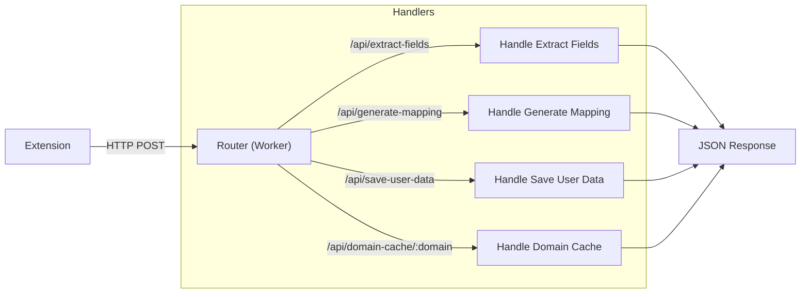
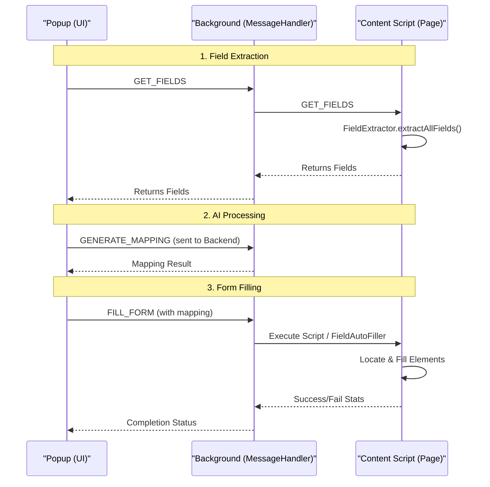

# High-Level Overview

This document provides a basic architectural overview of the Autofill extension and its backend services.

## 1. Backend Architecture

The backend is built on Cloudflare Workers using `itty-router` for handling API requests. It acts as the intelligence layer, processing field data and managing user profiles.

### Flow Diagram

### Key Components

- **Router**: Entry point that routes incoming HTTP requests to specific handlers based on the path (e.g., `/api/extract-fields`).
- **Handle Extract Fields**: Receives raw HTML/DOM snapshots and uses LLM/heuristics to identify and normalize form fields.
- **Handle Generate Mapping**: Maps identified fields to user data values (e.g., mapping "first_name" field to the user's stored "Name").
- **Handle Save User Data**: Securely updates or stores user profile information in the database.
- **Handle Domain Cache**: Retrieves cached field configurations for known domains to speed up processing.

---

## 2. Extension Architecture

The extension operates via a coordination of three main contexts: Popup (UI), Background (Logic/Messaging), and Content Script (DOM Interaction).

### Flow Diagram

### Key Components

- **Popup**: The user interface where users view detected fields, select profiles, and trigger the autofill process.
- **Background Script (`MessageHandler`)**:
    - Acts as the central hub for communication.
    - Handles robust messaging with retry logic to the Content Script.
    - Relays heavy processing requests (like mapping generation) to the Backend API.
- **Content Script**:
    - **`FieldExtractor`**: Scans the DOM to find inputs, selects, and textareas. Generates stable IDs for elements.
    - **`FieldAutoFiller`**: Receives mapping data and intelligently fills fields, handling shadow DOM and event dispatching (React).
    - **`DOMObserver`**: Watches for dynamic changes in the page to re-index fields if the form updates.

  - **TODO**
    - **`FieldAutoFiller Updation`** : Currently I am not able to use it for Select, lists, date fields
    - **`RAG Pipeline`** : Users Data could be stored in Vector DB for optimisation of Model Context.
    - **`Testing`** :  Testing for all types of forms any dumb user can make.
